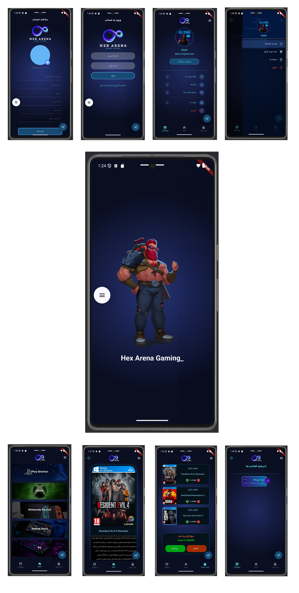

# 🎮 Console Game Store (Flutter Project)

[](https://flutter.dev/)
[](https://dart.dev/)
[](https://flask.palletsprojects.com/)
[]()
[](http://isfproject.ir)

---

> A complete mobile application for console video game shopping, developed using **Flutter** and connected to a **Flask** backend.  
> Originally started as a practice project, it has now evolved into a fully functional and testable mobile app.



---

## 📱 About the Project

This app is a fully functional mobile console game store built with Flutter and powered by a RESTful **Flask** backend. It includes real-time data, user authentication, and a rich shopping experience.

✅ **Live Server Available:**  
Hosted on: 🌐 [isfproject.ir](http://isfproject.ir)

---

## 🧩 Key Features

- 🗂 Game categories screen  
- 🎮 Game details page  
- 👤 User profile page  
- ✏️ Edit profile functionality  
- 🧾 Purchase history  
- 🛒 Shopping cart  
- 🔐 Login & Signup system  
- 💫 Splash screen with animation  
- 🎨 Enhanced UI/UX design with transitions  
- 🔗 Connected to live Flask REST API

---

## 🎯 Project Goals

- Improve skills in Flutter and Dart  
- Learn clean project architecture in Flutter  
- Build and consume RESTful API using Flask  
- Practice animations and modern UI/UX design principles

---

## 📦 Tech Stack

| Frontend      | Backend       | Database         |
|---------------|---------------|------------------|
| Flutter (Dart) | Flask (Python) | SQLite / PostgreSQL |

🔗 Domain: [isfproject.ir](http://isfproject.ir)

---

## 🚀 Getting Started

Clone and run the project locally:

```bash
git clone https://github.com/yourusername/console-game-store.git
cd console-game-store
flutter pub get
flutter run

